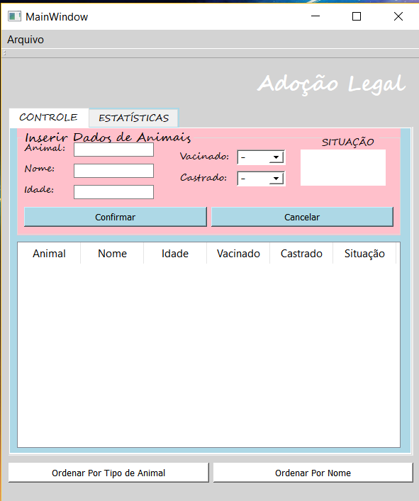
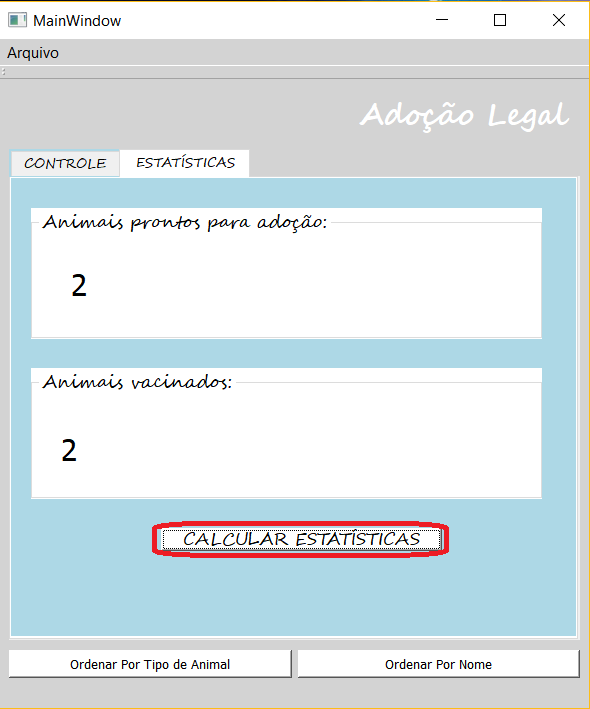
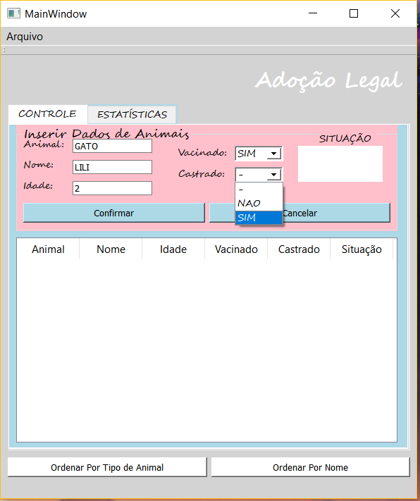
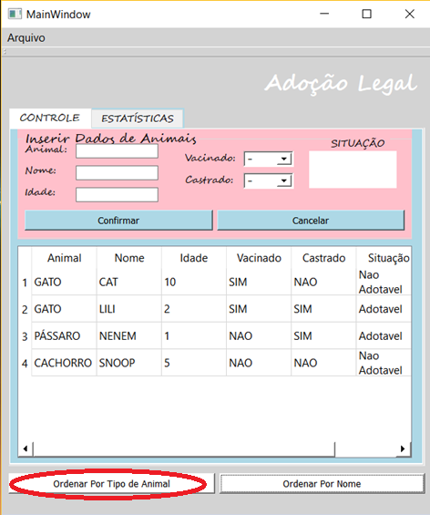
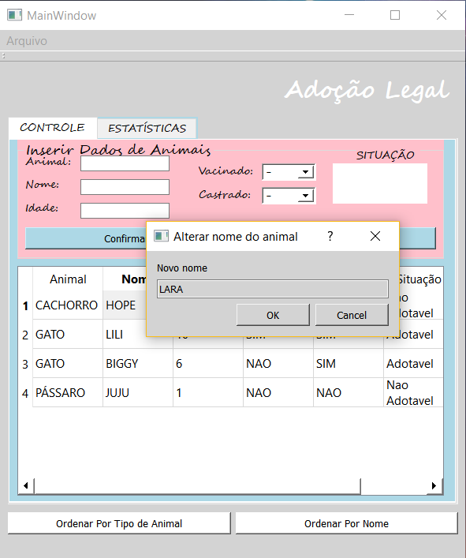

# Adocao-Legal
O projeto Adoção Legal é uma aplicação que cadastra animais e verifica se o animal pode ser doado. Foi feito utilizando o QT Creator para a disciplina de Técnicas de Programação.

Adoção Legal permite qu o usuário cadastre os animais com o tipo, nome, idade, se está vacinado e castrado. Dessa forma verifica se o animal está pronto para ser doado.

Além desta dela de início, onde se cadastra os animais para verificar a situação deles, a aplicação dispõe de outra tela, onde se encontram as estatísticas, de quantos animais estão prontos para adoção e quantos já são vacinados.

MANUAL DO USUÁRIO
Para começar a usar a aplicação basta inserir os dados do animal. Primeiro qual é animal, se é cachorro, gato ou qualquer outro tipo. Em seguida, é só digitar o nome, a idade, selecionar se ele foi vacinado e se foi castrado. Dessa forma, se o animal tiver sido castrado, ele estará pronto para ser adotado. 
Por exemplo, vamos adicionar um gato à nossa tabela: 

Ao selecionar se o animal foi castrado ou não, irá aparecer a situação dele no campo “SITUAÇÃO”.
Podemos adicionar quantos aninmais quisermos, e depois podemos ordená-los pelo tipo de animal, clicando no botão “Ordenar Por Tipo de Animal”, ou seja, para ficarem agrupados todos os animais da mesma espécie, em ordem alfabética. Por exemplo:

Após clicar neste botão de ordenação, por tipo de animal, eles vão ser organizados em ordem alfabética. Também podemos ordená-los pelo nome, também ordem alfabética, clicando no botão “Ordenar Por Nome”. 
Outra função da aplicação é que o usuário pode salvar a tabela de animais em um arquivo e pode carregá-la novamente na aplicação. Para salvar a tabela,  é necessário clicar em “Salvar Animais” e criar um arquivo .txt clicando o botão direito do mouse. Para carregar a tabela, basta clicar em “Carregar Animais” e selecionar o arquivo .txt que deseja.

Se o usuário errar o algo que foi digitado na hora do cadastro do animal, é simples para trocar, basta clicar duas vezes no item que deseja editar, e pronto, irá aparece uma mensagem perguntando se deseja mesmo alterar o item selecionado e poderá alterar. 

Para calcular as estatísticas dos animais que estão prontos para adoção e quais foram vacinados, é só clicar em “Estatísticas” e em seguida em “Calcular Estatísticas”: 

Agora você está pronto para utilizar esta aplicação e cuidar dos animais que estão precisando ser adotados! 

